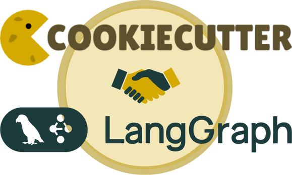

# rendered-project

This is the rendered version of the cookiecutter. The project you obtain when using the command cookiecutter on the template provided in this repository.

---

   
  
   
  <a href="https://github.com/hugoromerorico/production-agent-cookiecutter-langgraph">Template Source</a>

